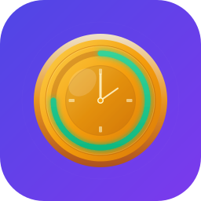

<p align="center">
  
</p>

<h1 align="center">TimerFloat</h1>

<p align="center">
  <strong>A minimalist floating timer that lives in your peripheral vision</strong>
</p>

<p align="center">
  
  
  
</p>

---

## Overview

TimerFloat keeps you aware of time without breaking focus. The floating overlay stays visible across all applications—including fullscreen apps—so you never have to switch contexts to check your timer.

**Design Philosophy:** *Time is a resource.* The golden coin aesthetic reminds you that every minute counts.

## Features

### Countdown Timer
- **Pomodoro presets** — 5m, 15m, 25m, 45m quick-start buttons
- **Custom duration** — Set any time you need
- **Visual progress ring** — Tapered stroke with tick marks
- **Color-coded urgency** — Indigo → Amber → Red as time runs low
- **Completion celebration** — Golden glow effect with satisfying sound

### Stopwatch
- **Distinct pill shape** — Instantly recognizable vs countdown mode
- **Teal color scheme** — Clear visual differentiation
- **Centisecond precision** — MM:SS.CC display
- **Pulsing indicator** — Know it's running at a glance

### Window Pinning
- **Pin to any window** — Timer follows your target app
- **Keyboard navigation** — Arrow keys + Enter in window picker
- **Auto-unpin** — Returns to saved position when window closes

### Always Visible
- **Floats above all apps** — Including fullscreen
- **Appears on all Spaces** — Never lose sight of your timer
- **Adjustable opacity** — Subtle when idle, solid on hover
- **Draggable** — Position anywhere on screen

### Keyboard Shortcuts
- Global hotkeys for start, pause, toggle
- Customizable in Settings

## Screenshots

| Timer | Stopwatch | Menu |
|:-----:|:---------:|:----:|
| Circular progress with tick marks | Pill-shaped with teal accent | Quick presets & mode picker |

## Design System

TimerFloat uses a custom design system with the **"Time as Resource"** theme:

| Color | Purpose |
|-------|---------|
| 🟣 **Indigo** `#6366F1` | Primary accent, active timer |
| 🟠 **Amber** `#F59E0B` | Warning, time running low |
| 🔴 **Red** `#EF4444` | Urgent, critical time |
| 🟢 **Emerald** `#10B981` | Complete, success |
| 🔵 **Teal** `#14A3A3` | Stopwatch mode |

**Typography:** IBM Plex Mono for distinctive, legible time displays.

## Requirements

- macOS 15.0 (Sequoia) or later
- Apple Silicon or Intel Mac

## Installation

### Download
1. Go to [Releases](https://github.com/salvadalba/nodaysidle-timerfloat/releases)
2. Download `TimerFloat.app.zip`
3. Unzip and drag to `/Applications`
4. Launch TimerFloat

### Build from Source
```bash
git clone https://github.com/salvadalba/nodaysidle-timerfloat.git
cd nodaysidle-timerfloat
xcodebuild -scheme TimerFloat -configuration Release build
```

The built app will be in `~/Library/Developer/Xcode/DerivedData/TimerFloat-*/Build/Products/Release/`

## Usage

1. **Launch** — TimerFloat appears in your menu bar
2. **Click the icon** — Opens the popover with timer controls
3. **Choose mode** — Timer (countdown) or Stopwatch
4. **Start** — Click a preset or enter custom duration
5. **Work** — The floating overlay keeps you on track
6. **Pin (optional)** — Hover over overlay, click pin icon, select a window

### Tips
- **Hover** the overlay to reveal the pin button
- **Drag** the overlay to reposition (when not pinned)
- **Right-click** menu bar icon for quick actions

## Architecture

```
TimerFloat/
├── Design/           # Design system (colors, typography, animations)
├── Models/           # TimerState, TimerMode, UserPreferences
├── Services/         # TimerService, WindowService, NotificationService
├── ViewModels/       # TimerViewModel with @Observable
├── Views/            # SwiftUI views and overlays
└── Resources/        # Fonts (IBM Plex Mono)
```

**Tech Stack:**
- Swift 6 with strict concurrency
- SwiftUI + AppKit for hybrid UI
- Actor-based TimerService for thread safety
- CGWindowList APIs for window pinning

## Contributing

Contributions welcome! Please:
1. Fork the repository
2. Create a feature branch
3. Run tests: `xcodebuild test -scheme TimerFloat`
4. Submit a pull request

## License

MIT License — see [LICENSE](LICENSE) for details.

---

<p align="center">
  <sub>Built with focus, for focus.</sub>
</p>
